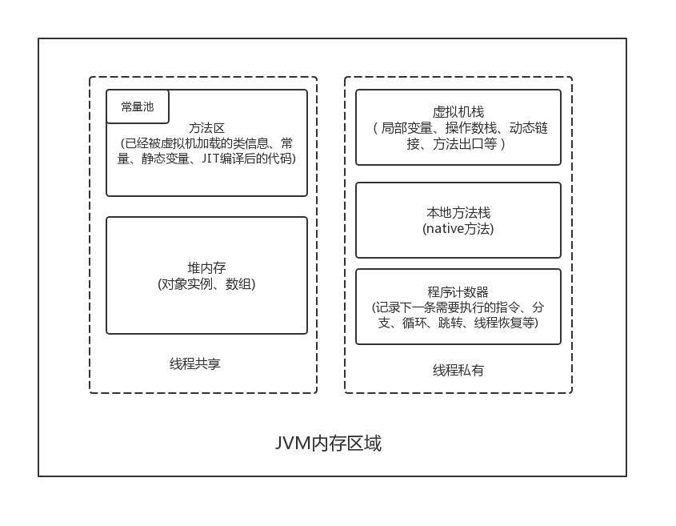
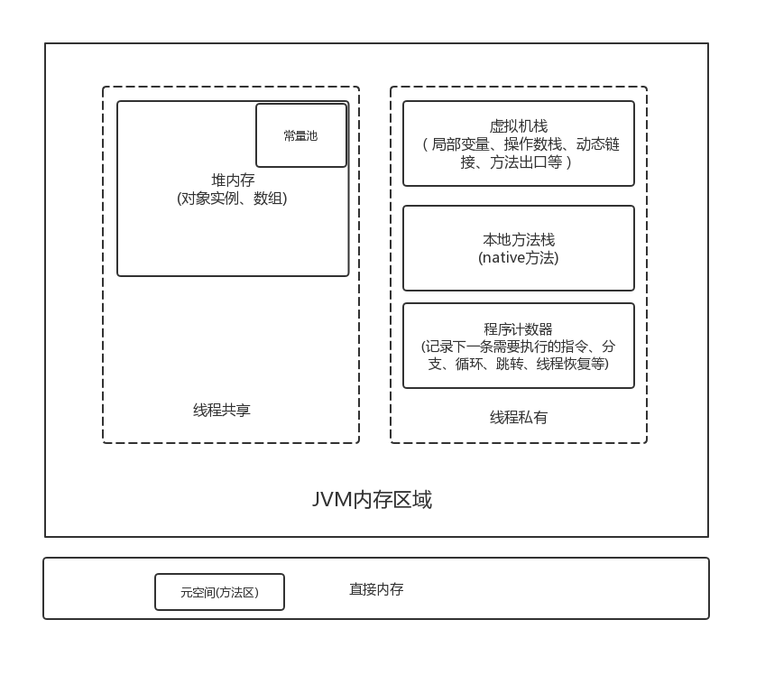
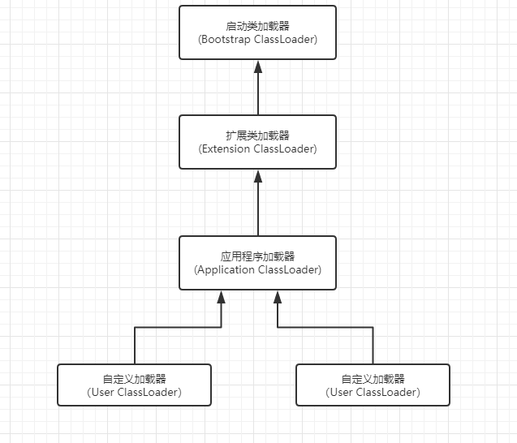

# 深入理解JAVA虚拟机
- [运行时数据区域](#二-运行时数据区域)
    - [堆内存](#21-堆内存)
    - [方法区](#22-方法区)
    - [虚拟机栈](#23-虚拟机栈)
    - [本地方法栈](#24-本地方法栈)
    - [程序计数器](#25-程序计数器)
    - [直接内存](#26-直接内存)
- [HotSpot虚拟机对象探秘](#三-HotSpot虚拟机对象探秘)
    - [对象的创建](#31-对象的创建)
    - [对象的内存布局](#32-对象的内存布局)
    - [对象的访问定位](#33-对象的访问定位)
    - [代码实现OutOfMemoryError异常](#34-代码实现OutOfMemoryError异常)
        - [堆内存溢出](#341-堆内存溢出)
        - [虚拟机栈和本地方法栈内存溢出](#342-虚拟机栈和本地方法栈内存溢出)
        - [方法区和运行时常量池溢出](#343-方法区和运行时常量池溢出)
        - [本地直接内存溢出](#344-本地直接内存溢出)
- [垃圾回收机制和内存分配策略](#四-垃圾回收机制和内存分配策略)
    - [对象已死吗](#41-对象已死吗)
         - [引用计数算法](#411-引用计数算法)
         - [可达性分析算法](#412-可达性分析算法)
    - [垃圾收集算法](#42-垃圾收集算法)
        - [标记-清除算法](#421-标记-清除算法)
        - [复制算法](#422-复制算法)
        - [标记整理算法](#423-标记整理算法)
        - [分代收集算法](#424-分代收集算法)
    - [看懂GC日志](#43-看懂GC日志)
- [内存分配和回收策略](#五-内存分配和回收策略)
    - [对象内存分配](#51-对象内存分配)
- [Class文件结构](#六-Class文件结构)
    - [魔数和Class文件的版本](#61-魔数和Class文件的版本)
- [类加载机制](#七-类加载机制)
    - [类加载的时机](#71-类加载的时机)
    - [类加载的过程](#72-类加载的过程)
    - [验证](#73-验证)
    - [双亲委派机制](#74-双亲委派机制)
        - [双亲委派模型](#741-双亲委派模型)
        - [破坏双亲委派模型](#742-破坏双亲委派模型)
- [Java内存模型与线程](#八-Java内存模型与线程)
        
## 一 先看下JDK1.8前的Java虚拟机的内存区域。




## JDK1.8的内存划分

## 二 运行时数据区域

### 2.1 堆内存 
对于大多数应用来说，Java堆内存(Java Heap)是Java虚拟机所管理的内存中最大的一块。堆内存是线程共享的，在虚拟机启动时创建，堆内存主要存放对象实例，也是GC主要活动区域。
堆内存还分新生代(Eden区，From Survivor区，To Survivor区)和老年代，进一步的划分内存区域是为了能更好的回收内存或者更快的分配内存。对象生成后最先放到Eden区，也就是新生代，新生代的对象很多都是"朝生夕死"的，在经过GC后会放入survivor1区，如果survivor1区放满了，就GC这个survivor1区，然后把还能存活的对象转移到survivor2区，那么此时survivor1中的对象就是可以回收的对象，然后把带有对象survivor2与没有对象的survivor1交换，因为gc survivor的时候是对第一个，应该把所有survivor中的对象都gc一次，看看对象是否可以清除。当我们多次gc的时候，survivor中仍然有对象存活，就将这些数据放到老年代中。如果老年代也存储不下的时候，会触发full gc。

### 2.2 方法区
方法区和堆一样是线程共享的内存区域，主要存储已被虚拟机加载的类信息、常量、静态变量、JIT编译器编译后的代码等信息。方法区有个名字Non-Heap，是把方法区和Java堆内存区分开。方法区也被称为永久代。方法区是规范层面的东西，规定了这个区域存放哪些东西，永久代是对方法区的实现。并不是所有jvm都有永久代的。JDK1.8已经彻底移除了这一区域，引入了一个新的内存区域元空间(metaspace)。
* 运行时常量池是方法区的一部分。Class 文件中除了有类的版本、字段、方法、接口等描述信息外，还有常量池信息.Java并不要求常量一定只有编译期才能产生，运行期间也可能将新的常量放入常量池中，比如`String`类的`intern()`方法。后面详细了解补充一下。

### 2.3 虚拟机栈
虚拟机栈是线程私有的，他的生命周期和线程相同。虚拟机栈描述Java方法执行的内存模型：每个方法在执行时都会创建一个栈帧(Stack Frame)。用于存储局部变量，操作数栈，动态链接，方法出口等信息。每个方法从调用到执行完毕的过程，都对应了一个栈帧在虚拟机栈中入栈和出栈的过程。局部变量存放了编译器可知的各种基本数据类型、对象的引用(reference类型，他不等于对象本身，引用是一个指向对象的地址的引用指针，也可以能是指向一个代表对象的句柄或者其他与此对象相关的位置)。在虚拟机栈用会有两种异常情况：
* 栈从数据结构上来说是"先进后出，后进先出"的特性。因此，死循环的递归调用或者递归很深的时候可能会造成栈内存溢出`StackOverflowError`。
* 如果虚拟机栈可以动态扩展，如果扩展时无法申请到足够的内存，就会抛出`OutOfMemoryError`异常。

### 2.4 本地方法栈
和虚拟机栈发挥的作用非常相似。区别在于虚拟机栈为虚拟机执行Java方法服务，而本地方法栈则为虚拟机用到的Native方法服务。在虚拟机规范中对本地方法栈中方法所使用的语言、方法、数据结构并没有强制规定，因此可以由具体的虚拟机实现。和虚拟机栈一样，本地方法栈也会抛出`StackOverFlowError `和`OutOfMemoryError `两种异常。

### 2.5 程序计数器
程序计数器是一块较小的内存空间，可以看做是当前线程所执行的字节码的行号指示器。首先我们要搞清楚JVM的多线程实现方式。JVM的多线程是通过CPU时间片轮转（即线程轮流切换并分配处理器执行时间）算法来实现的。也就是说，某个线程在执行过程中可能会因为时间片耗尽而被挂起，而另一个线程获取到时间片开始执行。当被挂起的线程重新获取到时间片的时候，它要想从被挂起的地方继续执行，就必须知道它上次执行到哪个位置，每个线程都有一个独立的程序计数器。
* 执行Java方法时，程序计数器记录的是正在执行的字节码指令的地址。
* 执行Native方法时，程序计数器的值为Undefined，因为Native是通过Java直接调用本地C/C++库，可以认为Native方法是C/C++库提供的接口。由于该方法实现不在java内进行，因此也就没有字节码。此内存区域是唯一一个在Java虚拟机规范中没有规定任何`OutOfMemoryError`情况的区域。

### 2.6 直接内存
直接内存(Direct Memory)并不是虚拟机运行时数据区的一部分，也不是Java虚拟机规范中定义的内存区域。但是这部分内存也被频繁地使用。而且也可能导致`OutOfMemoryError`异常出现。JDK1.4中新加入的NIO，引入了一种基于通道(Channel)与缓存区(Buffer)的IO方式，他可以使用Native函数库直接分配堆外内存，然后通过一个存储在 Java 堆中的 DirectByteBuffer 对象作为这块内存的引用进行操作。这样就能在一些场景中显著提高性能，因为避免了在 Java 堆和 Native 堆之间来回复制数据。直接内存的分配不会受到Java堆大小的限制，但是既然是内存就会受到本机总内存大小以及处理器寻址空间的限制。

## 三 HotSpot虚拟机对象探秘

### 3.1 对象的创建
* 类加载检查：
虚拟机遇到一条 new 指令时，首先将去检查这个指令的参数是否能在常量池中定位到这个类的符号引用，并且检查这个符号引用代表的类是否已被加载过、解析和初始化过。如果没有，那必须先执行相应的类加载过程。
* 分配内存：
在类加载检查通过后，就是分配内存，对象所需内存大小在类加载检查完成后就可以确定。为对象分配空间的任务等同于把一块确定大小的内存从Java堆内存中划分出来。分配的方式有两种：
   * 指针碰撞：假设堆内存是绝对规整的，用过的内存放在一边，没用过的放在另外一边，中间有个指针作为分界点的指示器，那么分配内存就是把指针向空闲空间移动一段与对象大小相等的距离。
   * 空闲列表：假设堆内存不是规整的，已使用的内存和未使用的互相交错，就不能用指针碰撞，虚拟机必须维护一个空闲空间的列表，记录哪些内存块是可以用的，在分配的时候找到一块足够大的内存划分给对象，并更新列表记录。这种方式叫 空闲列表。
* 设置对象头：
例如这个对象是那个类的实例、如何才能找到类的元数据信息、对象的哈希码、对象的 GC 分代年龄等信息。 这些信息存放在对象头中。 另外，根据虚拟机当前运行状态的不同，如是否启用偏向锁等，对象头会有不同的设置方式。
* 初始化对象：
从虚拟机的角度来讲此时对象已经产生了，但是对于Java来说，对象创建才刚开始，所有字段都为零。执行new指令后会接着执行init方法，把对象按照程序员的意愿，进行初始化，这样一个真正可用的对象才完全产生出来。

### 3.2 对象的内存布局
在 Hotspot 虚拟机中，对象在内存中的布局可以分为 3 块区域：对象头、实例数据和对齐填充。对象头包括两部分，第一部分用于存储对象自身的自身运行时数据（哈希码、GC 分代年龄、锁状态标志等），另一部分是类型指针，即对象指向它的类元数据的指针，虚拟机通过这个指针来确定这个对象是那个类的实例。如果对象是一个Java数组，那么在对象头中必须有一块用于记录数组长度的数据，因为虚拟机可以通过普通Java对象的元数据信息确定对象的大小，但是从数组的元数据中却无法确认数组的大小。对齐填充部分不是必然存在的，也没有什么特别的含义，仅仅起占位作用。 因为 Hotspot 虚拟机的自动内存管理系统要求对象起始地址必须是 8 字节的整数倍，换句话说就是对象的大小必须是 8 字节的整数倍。而对象头部分正好是 8 字节的倍数（1 倍或 2 倍），因此，当对象实例数据部分没有对齐时，就需要通过对齐填充来补全。

### 3.3 对象的访问定位
Java程序需要通过栈内存上的引用堆内存上的对象。虚拟机规范只规定了一个对象的引用，但是怎么定位、访问这个对象，不同的虚拟机可以有不同的实现。一般访问方式有两种：
* 句柄。如果使用句柄的话，堆内存就要划出一块内存作为句柄池，栈中的引用存放的就是对象的句柄地址。
* 直接指针。如果使用直接指针访问，那么 Java 堆对象的布局中就必须考虑如何放置访问类型数据的相关信息，而 reference 中存储的直接就是对象的地址。
两种对象访问方式各有优势。使用句柄来访问的最大好处是 reference 中存储的是稳定的句柄地址，在对象被移动时(垃圾回收时，对象移动是非常普遍的行为)只会改变句柄中的实例数据指针，而 reference 本身不需要修改。使用直接指针访问方式最大的好处就是速度快，它节省了一次指针定位的时间开销。

### 3.4 代码实现OutOfMemoryError异常

### 3.4.1 堆内存溢出

设置虚拟机启动参数：`-Xms20M -Xmx20M -Xmn10M -XX:+PrintGCDetails -XX:SurvivorRatio=8`。`-Xms20m`:初始化堆内存大小20M；`-Xmx20m`:堆内存最大为20M。将堆最大内存和最小内存设置一样，可以避免自动扩展内存。`-Xmn10M`:新生代内存10M；`-XX:+PrintGCDetails`输出GC详细日志。`-XX:SurvivorRatio=8`：设置两个Survivor和Eden的比值，8 表示两个Survivor ： Eden = 2：8，每个Survivor占 1/10。
java测试代码：
```java
/**
 * Created by zhao
 * 堆内存溢出
 * -Xms20M -Xmx20M -Xmn10M -XX:+PrintGCDetails -XX:SurvivorRatio=8
 */
public class HeapOOM {
    static class OOMObjet {
    }

    public static void main(String[] args) {
        List<OOMObjet> list = new ArrayList<>();
        while (true) {
            list.add(new OOMObjet());
        }
    }
}
```
输出：
```
[GC (Allocation Failure) [PSYoungGen: 8192K->1016K(9216K)] 8192K->4543K(19456K), 0.0066378 secs] [Times: user=0.03 sys=0.02, real=0.01 secs] 
[GC (Allocation Failure) --[PSYoungGen: 9208K->9208K(9216K)] 12735K->19445K(19456K), 0.0117774 secs] [Times: user=0.02 sys=0.00, real=0.01 secs] 
[Full GC (Ergonomics) [PSYoungGen: 9208K->0K(9216K)] [ParOldGen: 10237K->10211K(10240K)] 19445K->10211K(19456K), [Metaspace: 3230K->3230K(1056768K)], 0.1306755 secs] [Times: user=0.25 sys=0.00, real=0.13 secs] 
[Full GC (Ergonomics) [PSYoungGen: 8192K->7167K(9216K)] [ParOldGen: 10211K->8959K(10240K)] 18403K->16126K(19456K), [Metaspace: 3231K->3231K(1056768K)], 0.1517721 secs] [Times: user=0.38 sys=0.00, real=0.15 secs] 
[Full GC (Ergonomics) [PSYoungGen: 7813K->7667K(9216K)] [ParOldGen: 8959K->8959K(10240K)] 16772K->16626K(19456K), [Metaspace: 3231K->3231K(1056768K)], 0.1060525 secs] [Times: user=0.48 sys=0.00, real=0.11 secs] 
[Full GC (Allocation Failure) Exception in thread "main" java.lang.OutOfMemoryError: Java heap space
	at java.util.Arrays.copyOf(Arrays.java:3210)
	at java.util.Arrays.copyOf(Arrays.java:3181)
	at java.util.ArrayList.grow(ArrayList.java:265)
	at java.util.ArrayList.ensureExplicitCapacity(ArrayList.java:239)
	at java.util.ArrayList.ensureCapacityInternal(ArrayList.java:231)
	at java.util.ArrayList.add(ArrayList.java:462)
	at com.miss27.record.test.HeapOOM.main(HeapOOM.java:18)
[PSYoungGen: 7667K->7667K(9216K)] [ParOldGen: 8959K->8941K(10240K)] 16626K->16608K(19456K), [Metaspace: 3231K->3231K(1056768K)], 0.1079590 secs] [Times: user=0.36 sys=0.00, real=0.11 secs] 
Heap
 PSYoungGen      total 9216K, used 7939K [0x00000000ff600000, 0x0000000100000000, 0x0000000100000000)
  eden space 8192K, 96% used [0x00000000ff600000,0x00000000ffdc0ef0,0x00000000ffe00000)
  from space 1024K, 0% used [0x00000000ffe00000,0x00000000ffe00000,0x00000000fff00000)
  to   space 1024K, 0% used [0x00000000fff00000,0x00000000fff00000,0x0000000100000000)
 ParOldGen       total 10240K, used 8941K [0x00000000fec00000, 0x00000000ff600000, 0x00000000ff600000)
  object space 10240K, 87% used [0x00000000fec00000,0x00000000ff4bb538,0x00000000ff600000)
 Metaspace       used 3264K, capacity 4500K, committed 4864K, reserved 1056768K
  class space    used 352K, capacity 388K, committed 512K, reserved 1048576K
```
关键点：` java.lang.OutOfMemoryError: Java heap space`，堆内存溢出。

解决方案：
* 确定是内存泄漏(Memory Leak)还是内存溢出(Memory Overflow)。如果是内存泄漏可进一步用工具查看对象到GC ROOTS的引用链，就能找到对象是通过怎样的路径与GC ROOTS相关联并导致GC无法回收。掌握了泄漏对象的类型信息以及 GC ROOTS引用链就可以比较精准的定位出泄漏代码的位置；
* 如果是内存溢出，就说明内存中的对象确实都还活着，那么就应该检查堆参数设置`-Xmx`、`-Xms`，与物理内存对比看是否可以调大一点，从代码上检查某些对象的生命周期过长、持有状态过长的情况，尝试煎炒程序运行期间的内存消耗。

### 3.4.2 虚拟机栈和本地方法栈内存溢出

对于虚拟机栈和本地方法栈，在Java虚拟机规范中描述了两种异常：
* 如果线程请求的栈深度大于虚拟机所允许的最大深度，则会抛出`StackOverflowError`异常；
* 如果虚拟机栈扩展时，无法申请到内存，则会抛出`OutOfMemoryError`
其实这两种异常有些重叠的地方：第一种情况是栈内存被用完了，第二种情况是用完了申请不到空间，其实都是对同一件事的两种描述方式。

java测试代码：
```java

/**
 * Created by zhao
 * 栈溢出 StackOverflowError
 * 设置参数  -Xss128k 栈内存设置128k大小。
 */
public class JavaStackOOM {
    private int stackLength = 1;

    public void stackLeak() {
        stackLength++;
        System.out.println(stackLength);
        stackLeak();
    }

    public static void main(String[] args){
        JavaStackOOM oom = new JavaStackOOM();
        oom.stackLeak();
    }
}
```
输出：
```
...
981
982
Exception in thread "main" java.lang.StackOverflowError
```
无论是由于栈帧太大还是栈内存太小，当内存无法分配的时候就会抛出`StackOverflowError`异常。

### 3.4.3 方法区和运行时常量池溢出

java测试代码
```java
/**
 * Created by zhao
 * -XX:PermSize=10M -XX:MaxPermSize=10M 设置方法区内存大小 初始化为10M，最大容量10M
 * 而JDK1.7之前运行时常量池是在方法区里的，因此可以设置方法区的大小，从而间接限制其中的常量池大小
 */
public class ConstantPoolOOM {
    public static void main(String[] args) {
        List<String> list = new ArrayList<>();
        int i = 0;
        while (true) {
            list.add(String.valueOf(i++).intern());
        }
    }
}
```
这段代码在JDK1.6环境会报错。
```
Exception in thread "main" java.lang.OutOfMemoryError: PermGen space
```
运行时常量池溢出，由于常量池属于方法区，所以后面跟着`PermGen space`。
JDK1.8常量池移到了堆内存，方法区是JVM的规范，之前是用永久代来实现，JDK1.8中改成了元空间。本质上元空间和永久代类似，都是对JVM方法区的实现，不过元空间并不存在虚拟机中，而是在直接内存(本地内存)中。
可以通过下面的例子证明JDK1.8把常量池移到了堆内存：
```java
/**
 * Created by zhao
 * -Xms5m -Xmx5m 设置堆内存容量为5M
 */
public class ConstantPoolOOM {
    public static void main(String[] args) {
        List<String> list = new ArrayList<>();
        int i = 0;
        while (true) {
            list.add(String.valueOf(i++).intern());
        }
    }
}
```
输出：
```
Exception in thread "main" java.lang.OutOfMemoryError: Java heap space
```
intern()方法的实现不再是在常量池中创建与此String内容相同的字符串，而改为在常量池中记录Java Heap中首次出现的该字符串的引用，并返回该引用;

对这个字符串常量池String intern方法在写个例子测试。
```java
public class StringIntern {
    public static void main(String[] args) {
        String s1 = new StringBuilder().append("Hello").append("JVM").toString();
        System.out.println(s1.intern() == s1);//true

        String s2 = new StringBuilder("Hello").append("JVM").toString();
        System.out.println(s2.intern() == s2);//false

        System.out.println(s1 == s2.intern());//true
    }
}
```
在JDK1.6的结果是：`false  false`。在JDK1.7、JDK1.8是：`true  false`;
产生差异的原因是：
JDK1.6中 intern()方法是这样的：
* 如果常量池中存在相同的字符串，则返回常量池中对应字符串的引用；
* 会把首次遇到的字符串实例复制到常量池中，返回的也是常量池中对这个字符串的引用，而由`StringBuilder`创建的字符串的引用在栈中。所以返回false；

JDK1.8中 intern() 
* `s1.intern() == s1`为true，当执行`s1.intern()`的时候，JVM不再把s1对应的字面量复制一份到字符串常量池中，而是在字符串常量池中存储一份s1的引用，这个引用指向堆中的字面量，所以`s1.intern() == s1`其实是同一个引用；
* `s2.intern() == s2`为false，是因为s2.intern()发现常量池中已经存在一个指向堆中的字面量"HelloJVM"的引用，所有s2.intern()返回的引用其实和上面的s1的引用是同一个，而s2是`new StringBuilder("Hello").append("JVM").toString()`指向堆内存中的字面量"HelloJVM"，s2.intern() 和 s2指向的不是同一个对象，所以结果是false；
* `s1 == s2.intern()`为true，验证了上面的分析；


### 3.4.4 本地直接内存溢出
直接内存貌似和NIO有关，但是目前一直没有接触NIO，因此先记下书中的例子，后面遇到在细研究。
```java
/**
 * Created by zhao
 * -Xms20m -Xmx20m -XX:MaxDirectMemorySize=10m
 */
public class DirectMemoryOOM {
    private static final int _1MB = 1024 * 1024;

    public static void main(String[] args) throws IllegalAccessException {
        Field unsafeField = Unsafe.class.getDeclaredFields()[0];
        unsafeField.setAccessible(true);
        Unsafe unsafe = (Unsafe) unsafeField.get(null);
        while (true) {
            unsafe.allocateMemory(_1MB);
        }
    }
}
```
报错：
```
Exception in thread "main" java.lang.OutOfMemoryError
```
## 四 垃圾回收机制和内存分配策略

### 4.1 对象已死吗
垃圾回收机制在堆内存回收前，第一件事就是要确定哪些对象还活着，哪些对象已经死了。常用的两种方法是：引用计数算法和可达性分析算法
### 4.1.1 引用计数算法
给对象添加一个引用计数器，每当有一个地方引用它，计数器值就加一；相反的，当引用失效的时候，计数器值就减一；任何时刻计数器为0的对象就是不可能再被使用的。但是如果在对象循环引用的情况下，内存就不会回收；
### 4.1.2 可达性分析算法
通过称为"GC Roots"的对象作为起点，从这些节点开始向下搜索，搜索走过的路称为"引用链"，当一个对象到GC Roots没有任何引用链相连接的话，则证明此对象是不可用的。
在java中可以作为GC Roots的对象包括：
* 虚拟机栈(栈帧中的本地变量表)中的引用的对象；
* 方法区中静态属性引用的对象；
* 方法区中常量引用的对象；
* 本地方法栈的本地方法(native方法)

### 4.2 垃圾收集算法
### 4.2.1 标记-清除算法
首先标记出所有需要回收的对象，在标记完成后统一回收。主要有两个劣势：
* 效率问题，标记和清除效率都不是很高；
* 空间问题，标记清除后会产生大量不连续的内存碎片，太多的内存碎片空间可能会导致以后程序运行中需要分配大对象时，无法找到足够连续空间而不得不提前触发一次GC。
### 4.2.2 复制算法
将可用内存按容量划分为大小想等的两块From和To，当From被占满时GC将From中的存活对象按照顺序复制到To中，同时将From和To交换，这样就可以每次GC都对整个半区进行垃圾回收，内存分配上也就不用考虑内存碎片等情况。缺点是内存缩小了原来的一半。
### 4.2.3 标记整理算法
和标记清除算法类似，只是后续不是对内存清除，而是让所有存活的对象都向一端移动，然后直接清理掉端边界以外的内存。
### 4.2.4 分代收集算法
当前商业虚拟机的垃圾回收基本都用这种方法。它把内存分为新生代和老年代，这样就可以根据各个年代的特点采用最合适的方式。在新生代中的对象大部分都是朝生夕死的，只有少量存活，这时候就选用复制算法，只需要把较少的存活对象复制即可。而老年代因为对象存活率高，因此可以采用标记-清除或者标记-整理算法来回收。
### 4.3 看懂GC日志
这是从上面的例子copy出来的GC日志。
```
[GC (Allocation Failure) [PSYoungGen: 8192K->1016K(9216K)] 8192K->4543K(19456K), 0.0066378 secs] [Times: user=0.03 sys=0.02, real=0.01 secs] 
[GC (Allocation Failure) --[PSYoungGen: 9208K->9208K(9216K)] 12735K->19445K(19456K), 0.0117774 secs] [Times: user=0.02 sys=0.00, real=0.01 secs] 
[Full GC (Ergonomics) [PSYoungGen: 9208K->0K(9216K)] [ParOldGen: 10237K->10211K(10240K)] 19445K->10211K(19456K), [Metaspace: 3230K->3230K(1056768K)], 0.1306755 secs] [Times: user=0.25 sys=0.00, real=0.13 secs] 
[Full GC (Ergonomics) [PSYoungGen: 8192K->7167K(9216K)] [ParOldGen: 10211K->8959K(10240K)] 18403K->16126K(19456K), [Metaspace: 3231K->3231K(1056768K)], 0.1517721 secs] [Times: user=0.38 sys=0.00, real=0.15 secs] 
[Full GC (Ergonomics) [PSYoungGen: 7813K->7667K(9216K)] [ParOldGen: 8959K->8959K(10240K)] 16772K->16626K(19456K), [Metaspace: 3231K->3231K(1056768K)], 0.1060525 secs] [Times: user=0.48 sys=0.00, real=0.11 secs] 
[Full GC (Allocation Failure) Exception in thread "main" java.lang.OutOfMemoryError: Java heap space
	at java.util.Arrays.copyOf(Arrays.java:3210)
	at java.util.Arrays.copyOf(Arrays.java:3181)
	at java.util.ArrayList.grow(ArrayList.java:265)
	at java.util.ArrayList.ensureExplicitCapacity(ArrayList.java:239)
	at java.util.ArrayList.ensureCapacityInternal(ArrayList.java:231)
	at java.util.ArrayList.add(ArrayList.java:462)
	at com.miss27.record.test.HeapOOM.main(HeapOOM.java:18)
[PSYoungGen: 7667K->7667K(9216K)] [ParOldGen: 8959K->8941K(10240K)] 16626K->16608K(19456K), [Metaspace: 3231K->3231K(1056768K)], 0.1079590 secs] [Times: user=0.36 sys=0.00, real=0.11 secs] 
Heap
 PSYoungGen      total 9216K, used 7939K [0x00000000ff600000, 0x0000000100000000, 0x0000000100000000)
  eden space 8192K, 96% used [0x00000000ff600000,0x00000000ffdc0ef0,0x00000000ffe00000)
  from space 1024K, 0% used [0x00000000ffe00000,0x00000000ffe00000,0x00000000fff00000)
  to   space 1024K, 0% used [0x00000000fff00000,0x00000000fff00000,0x0000000100000000)
 ParOldGen       total 10240K, used 8941K [0x00000000fec00000, 0x00000000ff600000, 0x00000000ff600000)
  object space 10240K, 87% used [0x00000000fec00000,0x00000000ff4bb538,0x00000000ff600000)
 Metaspace       used 3264K, capacity 4500K, committed 4864K, reserved 1056768K
  class space    used 352K, capacity 388K, committed 512K, reserved 1048576K 
```

`[GC`和`Full GC`说明了这次垃圾回收的停顿类型，而不是用来区分新生代GC还是老年代GC的。如果有`Full`说明这次GC是发生了`Stop-The-World`的。如果是调用`System.gc()`触发的，那么会显示`[Full GC (System.gc())`。
* `PSYoungGen`：表示新生代，这个名称由收集器决定。PS是Parallel Scavenge收集器的缩写，它配套的新生代称为PSYoungGen，新生代又分化eden space、from space和to space这三部分
* `ParOldGen`：Parallel Scavenge收集器配套的老年代
* `Metaspace`： Parallel Scavenge收集器配套的永久代
* `total` & `used`：总的空间和用掉的空间
* 第一行的`[PSYoungGen: 8192K->1016K(9216K)]`表示 GC前该内存区域已使用容量->GC后该内存区域已使用容量，后面圆括号里面的9216K为该内存区域的总容量。
* `8192K->4543K(19456K), 0.0066378 secs`表示 GC前Java堆已使用容量->GC后Java堆已使用容量，后面圆括号里面的19456K为Java堆总容量。PSYoungGen耗时
* `[Times: user=0.03 sys=0.02, real=0.01 secs]`表示 用户消耗的CPU时间、内核态消耗的CPU时间、操作从开始到结束所经过的墙钟时间（Wall Clock Time）
user是用户态耗费的时间，sys是内核态耗费的时间，real是整个过程实际花费的时间。user+sys是CPU时间，每个CPU core单独计算，所以这个时间可能会是real的好几倍。
CPU时间和墙钟时间的差别是，墙钟时间包括各种非运算的等待耗时，例如等待磁盘I/O、等待线程阻塞，而CPU时间不包括这些耗时。
* 第三行的full gc`[Full GC (Ergonomics) [PSYoungGen: 9208K->0K(9216K)] [ParOldGen: 10237K->10211K(10240K)] 19445K->10211K(19456K), [Metaspace: 3230K->3230K(1056768K)], 0.1306755 secs] [Times: user=0.25 sys=0.00, real=0.13 secs]`表示 Young区GC前内存占用->GC后内存占用(新生代总内存大小)；Old老年代GC前内存占用->GC后内存占用(老年代总内存大小)；metaspace区GC前内存占用->GC后内存占用(元空间(方法区)总内存大小),GC用户耗时，Times:用户耗时 sys=系统时间, real=实际时间 。
规律：**[名称：gc前内存占用-> gc后内存占用（该区内存总大小）]**。
 
## 五 内存分配和回收策略
对象主要分配在新生代的Eden区上，少数情况也可能直接分配在老年代中，分配的规则不是百分百固定的，还取决于使用的哪一种垃圾回收器和虚拟机内存相关的参数设置。

### 5.1 对象内存分配
大多数情况下对象优先分配在Eden区，如果Eden区内存不够，虚拟机将会执行一次`Minor GC`。
* `Minor GC` 指发生在新生代的垃圾收集动作，当Eden区满时，触发`Minor GC`。新生代的对象大部分是朝生夕死的，因此`Minor GC`非常频繁，回收速度也比较快；
* `Full GC` 是清理整个堆内存空间，有几种触发情况：
   * 调用`System.gc()`时，系统建议执行`Full GC`，但是不一定会执行；
   * 老年代空间不足
本来想跑一两个例子证明对象分配是否先分配到Eden区，大对象直接分配在老年代，但是试了好多次，发现JDK8运行一个main方法 Eden区都要占用2M多的内存，测试起来有点麻烦，还要重新下低版本JDK，后面有机会在补上吧。

## 六 Class文件结构
任何一个Class文件都对应着唯一一个类或者接口的定义信息，但是反过来说，类或者接口并不一定都得定义在文件里(可以使用类加载器直接生成)。Class文件是一组以8位字节为基础的二进制流，各个数据严格艳照顺序紧凑的排列在Class文件中，中间没有任何分隔符，这使得整个Class文件中存储的内容几乎都是程序运行的必要数据。Class文件格式采用类似于C语言结构体的结构来存储数据，这种结构中只有两种数据类型：无符号数和表。
* 无符号数：属于基本数据类型，以u1、u2、u4、u8来分别表示1个字节、2个字节、4个字节、8个字节的无符号数，无符号数可以用来描述数字、索引引用、数量值或者按照UTF-8编码构成字符串值；
* 表：由多个无符号数或者其他表作为数据项构成的复合数据类型，所有表都习惯性的以`_info`结尾。表用于描述有层次关系的复合结构的数据，整个Class文件本质上就是一张表。
### 6.1 魔数和Class文件的版本
一个文件能否被Java虚拟机接受，不是通过文件的扩展名来进行识别的。每个Class文件的头4分字节称为魔数(Magic Number)，它的唯一作用是确定这个文件是否为一个能被虚拟机接受的Class文件。值为：0xCAFEBABE。紧接着魔数的４个字节存储的是Class文件的版本号：第５和第６个字节是次版本号（Minor Version），第７和第８个字节是主版本号（Major Version）.
Java的版本号是从45开始的，JDK1.1之后的每个JDK版本发布主版本号向上加１（JDK1.0~1.1使用了45.0~45.3的版本号），高版本的JDK能向下兼容以前版本的Class文件。


## 七 类加载机制

### 7.1 类加载的时机
类从被加载到虚拟机内存中开始，到卸载出内存为止，它的整个生命周期包括：加载、验证、准备、解析、初始化、使用、卸载 7个阶段。其中验证、准备、解析部分统称为连接。
虚拟机规范严格规定了有且只有5种情况必须对类进行"初始化"(加载、验证、准备自然需要在此之前开始)：
* 遇到new、getstatic、putstatic、invokestatic这4条字节码指令的时候，如果类没有进行初始化，则先要触发初始化操作。生成这4条指令最常见的Java代码场景是：使用new关键字实例化对象的时候、读取或设置一个类的静态字段的时候、调用一个类的静态方法的时候；
* 使用java.lang.reflect包的方法对类进行反射调用的时候。如果类没有初始化，则先触发初始化操作；
* 当初始化一个类的时候，发现其父类还没有初始化过，则需要先触发父类的初始化；
* 当虚拟机启动时，用户需要指定一个要执行的主类(包含main方法的那个类)，虚拟机会先初始化这个主类；
* 当使用动态语言支持时，如果一个java.lang.invoke.MethodHandle实例最后解析结果REF_getStatic、REF_putStatic、REF_invoikeStatic的方法句柄，并且这个方法句柄所对应的类没有进行初始化，则先要触发其初始化。
对于这5种会触发初始化的场景，JVM规范中使用了一个很强烈的限定语："有且只有"，这5种场景中的行为称为对一个类镜像主动引用。除此之外所有引用类的方法都不会触发初始化，称为被动引用。
写几个测试用例说明什么叫被动引用：
```java
/**
 * Created by zhao
 * 被动引用一
 * 通过子类引用父类的静态变量，不会导致子类初始化
 */
public class SuperClass {
    static {
        System.out.println("SuperClass init");
    }
    public static int value=10;
}
```
子类：
```java
/**
 * Created by zhao
 */
public class SubClass extends SuperClass {
    static {
        System.out.println("SubClass init");
    }
}
```
测试：
```java
public class NotInitialization {
    public static void main(String[] args) {
        System.out.println(SubClass.value);
    }
}
```
发现只会输出`SuperClass init`。对于静态变量，只有直接定义这个字段的类才会被初始化，因此通过子类引用父类中定义的静态变量，只会触发父类初始化而不会触发子类初始化。是否要触发子类的加载和验证在JVM规范中并没有明确规定，这点取决于虚拟机的具体实现。
### 7.2 类加载的过程
在加载阶段，虚拟机需要完成以下3件事情：
* 通过一个类的全限定名来获取定义此类的二进制字节流；
* 将这个字节流所代表的静态存储结构转化为方法区的运行时数据结构；
* 在内存中生成一个代表这个类的java.lang.Class对象，作为这个类的各种数据的访问入口。
虚拟机规范这3点要求不算具体，比如第一条`通过一个类的全限定名来获取定义此类的二进制字节流`没有指明二进制字节流要从Class文件获取，还可以从：
* 从ZIP包中获取，这很常见，最终成为JAR、EAR、WAR格式的基础；
* 从网络中获取；
* 运行时计算生成，也就是动态代理技术；
* 由其他文件生成，典型场景就是JSP，由JSP生成对应的Class文件；
* 从数据库中读取，这种场景比较少见。
类加载过程既可以使用系统提供的引导类加载器完成，也可以由用户自定义的类加载器去完成，开发人员可以自定义类加载器。
### 7.3 验证
验证是连接阶段的第一步，这阶段是为了确保Class文件的字节流中包含的信息符合当前虚拟机的要求，并且不会危害到虚拟机自身的安全。
验证大致分为4个阶段的动作：文件格式验证、元数据验证、字节码验证、符合引用验证。
* 文件格式验证：是否符合Class文件格式的规范，并且能被当前虚拟机处理。这一阶段验证的东西比较多，大概有：
   * 是否以魔数0xCAFEBABE开头；
   * 主次版本号是否在当前虚拟机处理范围之内；
   * 常量池的常量中是否有不被支持的常量类型；
   * 指向常量的各种索引值中是否有指向不存在的常量或不符合类型的常量。等等

* 元数据验证：主要验证类的元数据语义是否合法，保证不存在不符合Java语言规范的元数据信息。
   * 这个类是否有父类，(除了java.lang.Object之外，所有的类都应当有父类);
   * 这个类是否继承了不允许继承的类(final修饰的类)
   * 如果这个类不是抽象类，是否实现了其父类或接口中要求实现的所有方法。等等
* 字节码验证：对类的方法体进行效验，保证类的方法在运行时不会做出危害虚拟机的安全事件。
   * 保证任意时刻操作数帧的数据类型和指令代码序列都能配合工作，例如在栈放了一个int类型的数据，使用时却按照long类型来加载；
   * 保证跳转指令不会跳转到方法体以外的地方；
   * 保证方法体中类型转换是有效的。等等
* 符号引用验证
   * 符号引用中通过字符串描述的全限定名是否能找到对应的类；
   * 在指定类中是否存在符合方法的字段描述符；
   * 符号引用中的类、字段、方法的访问性(private、public、default、protected)是否可被当前类访问。等等

### 7.4 双亲委派机制
从Java虚拟机角度来说，只存在两种不同的类加载器：一是启动类加载器(Bootstrap ClassLoader)，这个类加载器由C++实现，是虚拟机自身的一部分。另一个就是所有其他种类的类加载器，这些类加载器都是由Java实现，独立于虚拟机外部，并且全部继承抽象类java.lang.ClassLoader。从Java开发角度来看，可以分3种类加载器。
### 7.4.1 双亲委派模型
* 启动类加载器(Bootstrap ClassLoader)：负责将存放在`JAVA_HOME`lib目录中的类库加载到虚拟机内存中；
* 扩展类加载器：主要负责加载jre/lib/ext目录下的一些扩展的jar。
* 应用程序加载器(系统类加载器)：负责加载用户类路径上(classpath)所指定的类库。
我们的应用程序都是由这3种类加载器互相配合使用进行加载的，如果有需要还可以自定义类加载器，下图展示的类加载器之间的这种层次关系，称为类加载器的双亲委派机制。

双亲委派模型的工作过程是：
* 如果一个类加载器收到了类加载的请求，它首先不会自己去尝试加载这个类，而是把这个请求委派给父类加载器去完成；
* 每一个层次的类加载器都是如此。因此，所有的加载请求最终都应该传送到顶层的启动类加载器中；
* 只有当父加载器反馈自己无法完成这个加载请求时（搜索范围中没有找到所需的类），子加载器才会尝试自己去加载；



执行过程：
1. 当应用程序加载器加载一个class时，它首先不会自己去尝试加载这个类，而是把类加载请求委派给父类加载器Extension ClassLoader去完成。
2. 当扩展类加载器加载一个class时，它首先也不会自己去尝试加载这个类，而是把类加载请求委派给Bootstrap ClassLoader去完成。
3. 如果Bootstrap ClassLoader加载失败（例如在$JAVA_HOME/jre/lib里未查找到该class），会使用Extension ClassLoader来尝试加载；
4. 若Extension ClassLoader也加载失败，则会使用Application ClassLoader来加载，如果Application ClassLoader也加载失败，则会报出异常ClassNotFoundException

* 作用：
1. 对于任意一个类，都需要由加载它的类加载器和这个类本身一同确立其在虚拟机中的唯一性，每一个类加载器，都拥有一个独立的类名称空间。因此，使用双亲委派模型来组织类加载器之间的关系，有一个显而易见的好处：类随着它的类加载器一起具备了一种带有优先级的层次关系。例如类java.lang.Object，它由启动类加载器加载。双亲委派模型保证任何类加载器收到的对java.lang.Object的加载请求，最终都是委派给处于模型最顶端的启动类加载器进行加载，因此Object类在程序的各种类加载器环境中都是同一个类。相反，如果没有使用双亲委派模型，由各个类加载器自行去加载的话，如果用户自己编写了一个称为java.lang.Object的类，并用自定义的类加载器加载，那系统中将会出现多个不同的Object类，Java类型体系中最基础的行为也就无法保证，应用程序也将会变得一片混乱。
2. 避免同一个类被多次加载。比如有类A和类B，都需要加载System类，
   * 如果没有双亲委派机制，那么类A就会加载一份System，类B也会加载一份System，这样内存中就有两个System；
   * 如果使用委托机制，则会递归向父加载器查找，也就是首选用Bootstrap Classloader尝试加载，如果找不到在向下，这里的System在Bootstrap加载器就能加载，然后类B也要加载System，这时它也会往上找到Bootstrap加载器，此时发现已经加载过System就直接返回内存中的System即可，不需要重新加载，这样内存中只有一份System字节码了。
   
### 7.4.2 破坏双亲委派模型
双亲委派模型并不是强制性的约束，而是Java设计者推荐给开发人员类加载器实现方式。

引入一个面试题：能不能自己写个类叫java.lang.System？
答案：通常不可以，但可以采取另类方法达到这个需求。 
解释：为了不让我们写System类，类加载采用委托机制，这样可以保证爸爸们优先，爸爸们能找到的类，儿子就没有机会加载。而System类是Bootstrap加载器加载的，就算自己重写，也总是使用Java系统提供的System，自己写的System类根本没有机会得到加载。但是，我们可以自己定义一个类加载器来达到这个目的，为了避免双亲委托机制，这个类加载器也必须是特殊的。由于系统自带的三个类加载器都加载特定目录下的类，如果我们自己的类加载器放在一个特殊的目录，那么系统的加载器就无法加载，也就是最终还是由我们自己的加载器加载。

## 八 Java内存模型与线程
//todo 等系统的学习完多线程后在写
