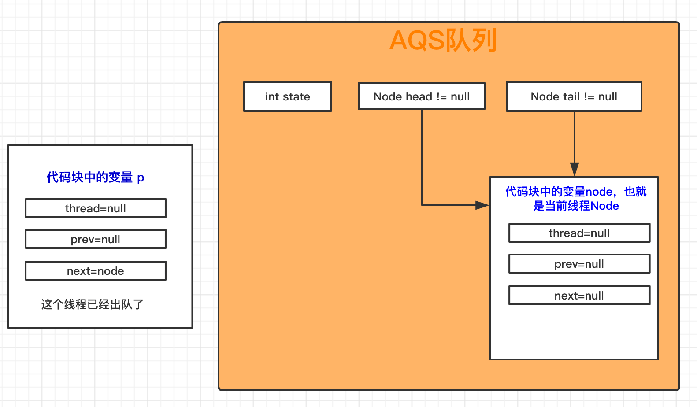

# JUC-AQS

- [AQS](#一-AQS)
    - [什么是CAS](#11-什么是CAS)    
    - [什么是自旋锁](#12-什么是自旋锁)    
    - [AQS源码](#13-AQS源码)    
        - [概览](#131-概览)
        - [waitStatus状态](#132-waitStatus状态)
        - [acquire方法](#133-acquire方法)
        - [addWaiter方法](#134-addWaiter方法)
    

## 一 AQS
juc包下提供了很多线程安全的类或者接口，可以直接提供给开发者使用，比如`ReentrantLock`、`CountDownLatch`等等，很多接口都是基于aqs实现的，所以在学习juc并发包下的源码前，有必要先了解一下什么是aqs。

AQS全名：`AbstractQueuedSynchronizer`抽象队列同步器，是`java.util.concurrent.locks`包下的一个抽象类。要注意的是它不是一个锁，只是为实现锁提供了一些底层实现。AQS核心是使用了CAS+队列+自旋锁以及`park`、`unpark`等。在看AQS前要先把自旋锁和CAS大概说一下。

### 1.1 什么是CAS

都知道JAVA中`volatile`关键字能解决共享变量的可见性问题，但是不能解决原子性问题，而CAS即`compare and swap`，它是JDK提供的非阻塞原子性操作，它通过硬件保证了比较-更新操作的原子性。在JDK提供的`Unsafe`类提供了一系列的`compareAndSwap*`方法，保证原子性。
CAS有四个操作数，分别是：对象内存位置，对象中变量的偏移量、变量预期值和新的值。操作含义是：如果对象obj中内存偏移量为`stateOffset`的变量值为`except`，则使用新的值替换掉旧值`except`。这是处理器提供的一个原子性操作。我从AQS里复制了一段CAS的源码，

```
protected final boolean compareAndSetState(int expect, int update) {
    // See below for intrinsics setup to support this
    return unsafe.compareAndSwapInt(this, stateOffset, expect, update);
}
```

这个源码中`this`表示当前对象，`stateOffset`表示`state`的内存地址，`except`是预期值， `update`就是你要修改后的值。

* CAS优缺点

* 优点：
1. 由于CAS是非阻塞的，可避免死锁，线程间的互相影响非常小;

2. 没有锁竞争带来的系统开销，也没有线程间频繁调度的开销。

* 缺点：
1. 经典的ABA问题：假设t1线程使用CAS修改初始值为A的变量X，那么t1线程会先去获取当前变量X的值(值是A)，然后使用CAS尝试修改X的值为B，如果使用CAS操作成功了，这样就是没问题的吗？有可能在线程t1获取变量X的值A后，在执行CAS之前，线程t2使用CAS修改了变量X的值为B，然后又使用CAS修改回A。虽然t1线程执行CAS的时候变量X的值是A，但是这个A已经不是t1线程获取时的那个A了，这就是ABA问题。
ABA问题就是因为变量的状态值产生了环形转换，变量的值可以从A到B，然后在从B到A。JDK中的`AtomicStampedReference`类给每个变量的状态都配了一个时间戳，从而避免了ABA问题。

2. 某个线程通过CAS方式操作某个变量不成功，长时间自旋，则会对CPU造成CPU空转，浪费性能。 

### 1.2 什么是自旋锁

指当一个线程在获取锁的时候，如果锁已经被其它线程获取，那么该线程将循环等待，然后不断的判断锁是否能够被成功获取，直到获取到锁才会退出循环。

* 自旋锁优缺点

自旋锁又那些优缺点呢？

* 优点
1. 自旋锁不会使线程状态发生变换，即线程一直都是处于活跃状态，不会被阻塞，减少了CPU上下文切换的开销；

2. 非自旋锁在获取不到锁的时候会进入阻塞状态，进入内核态，当前面的线程释放锁后，然后又要从内核态切换成用户态去竞争锁，这种来回切换导致锁的性能很差(1.6之前的`synchronized`)，所以相对来说，自旋转速度更快。

* 缺点

1. 自旋锁如果持有锁很长时间，造成其他线程一直在处于死循环中，造成CPU资源浪费，甚至耗尽CPU资源；

2. 自旋锁没法保证公平性和可重入性。

下面是CAS+自旋锁的伪代码：

```java
/**
 * @author: zhao
 * 自旋锁保证线程安全伪代码
 */
public class LockTest01 {
    volatile int state = 0;//表示是否有线程持有了锁

    //加锁
    void lock() {
        //自旋
        while (!compareAndSet(0, 1)) {//如果加锁失败
            //继续循环下去
        }
        //如果加锁成功，方法执行结束。
    }

    //解锁
    void unlock() {
        state = 0;//把state设置成0，表示当前没有线程获得锁
    }

    boolean compareAndSet(int except, int newValue) {
        //CAS操作，如果成功把state的值修改，则返回true
        return true;
    }
}

```


### 1.3 AQS源码

这里源码逻辑可能比较绕，所以在下面分析的时候，我会把if else分开分析。分析if方法体的时候，就不用看else里面的东西，反之也一样。

### 1.3.1 概览

先看一下AQS里的数据结构怎么定义的吧。

1. 首先AQS定义了一个state表示共享资源状态和锁冲入的次数

```
private volatile int state;
```

2. 定义了Node静态内部类，AQS里自己维护了一个先进先出的双向队列。

```
//上一个节点
volatile Node prev;
//下一个节点
volatile Node next;
//当前node节点里的线程
volatile Thread thread;
//表示该节点里线程此时的状态
volatile int waitStatus;
//还有其他一些属性

```

3. 定义队列头和尾部。

```
private transient volatile Node head;

private transient volatile Node tail;
```

AQS定义两种资源共享方式：Exclusive（独占，只有一个线程能执行，如ReentrantLock）和Share（共享，多个线程可同时执行，如Semaphore/CountDownLatch，AQS帮我们实现了线程加锁失败入队、唤醒、出队的操作，而具体怎么加锁和解锁不同的实现类有自己不同的实现，比如公平锁和非公平锁的加锁方式就不同.

### 1.3.2 waitStatus状态

Node节点是对每一个加锁失败的线程的封装对象，里面包含了上一个节点、下一个节点和当前节点的线程以及线程的状态：是否被取消、是否需要被唤醒等等，在Node对象里用`waitStatus`字段表示。

```
/** 表示当前结点已取消调度。当timeout或被中断（响应中断的情况下），会触发变更为此状态，进入该状态后的结点将不会再变化 */
static final int CANCELLED =  1;
/** 表示后继结点在等待当前结点唤醒。后面结点入队时，会将前一个结点的状态更新为SIGNAL(银行排队办业务，就是跟前排在自己前面的那个人说一下，我要休眠了，你业务办完了叫我一声)*/
static final int SIGNAL    = -1;
/** 线程在条件队列里等待，表示结点等待在Condition上，当其他线程调用了Condition的signal()方法后，CONDITION状态的结点将从等待队列转移到同步队列中，等待获取同步锁 */
static final int CONDITION = -2;
/**
 * waitStatus value to indicate the next acquireShared should
 * unconditionally propagate
 * 释放共享资源时，需要通知其他节点
 * 共享模式下，前继结点不仅会唤醒其后继结点，同时也可能会唤醒后继的后继结点
 */
static final int PROPAGATE = -3;
volatile int waitStatus;
```

### 1.3.3 acquire方法

该方法是获取共享资源的顶层方法，里面调用了`tryAcquire`方法，`tryAcquire`方法是用来尝试获取资源，但是在AQS里并没有实现，有不同的实现类根据自己情况去实现。

```
public final void acquire(int arg) {
    if (!tryAcquire(arg) &&
        acquireQueued(addWaiter(Node.EXCLUSIVE), arg))
        selfInterrupt();
}
```

如果没有获取到资源，则会走addWaiter方法。

### 1.3.4 addWaiter方法

`tryAcquire`方法获取资源失败后则走`addWaiter`方法将当前线程封装成Node对象，插入到AQS队列。看代码可以知道，一开始把tail赋值给了pred。有两种执行逻辑：

情况一：如果pred不为null，说明当前AQS已经存在队列了，直接把当前Node插入到队尾即可，代码中已经加了注释。

情况二：如果pred为null，说明现在AQS中还没有队列，则会进入enq方法；

```
private Node addWaiter(Node mode) {
    Node node = new Node(Thread.currentThread(), mode);//创建一个Node实例，mode有两种：EXCLUSIVE（独占）和SHARED（共享），这里传过来的是  EXCLUSIVE
    // Try the fast path of enq; backup to full enq on failure
    Node pred = tail;// tail是AQS的中表示同步队列队尾的属性，刚开始为null，所以进行enq(node)方法
    //逻辑一：如果pred不为null
    if (pred != null) {//如果pred不为空，说明已经有队列了
        node.prev = pred;//把当前节点的prev指向pred，把新节点插到刚才尾节点后面了，并建立了指向
        if (compareAndSetTail(pred, node)) {//用CAS操作，把当前node设置为tail节点
            pred.next = node;//把老的尾节点的Node对象的next指向新的node节点
            return node;
        }
    }
    //逻辑二：如果tail为null，说明当前AQS中没有队列，则进入enq方法
    enq(node);//
    return node;
}
```

* enq方法

enq方法用自旋把当前节点放到队列中去，如果队列不存在则创建一个。假设现在是第一次进该方法，也就是说当前AQS没有队列，则进入逻辑一方法体，else部分暂时先不看。

```
private Node enq(final Node node) {
    //自旋
    for (;;) {
        Node t = tail;//第一次进来的时候tail为null
        //逻辑一见下图
        if (t == null) { // Must initialize
            if (compareAndSetHead(new Node()))//创建一个Node对象，用CAS操作设置为head节点
                tail = head;//此时队列中只有一个节点就是上面刚创建的head节点，现在把tail也指向它，由于没有return 继续循环
        } else {
            //逻辑二
            node.prev = t;
            if (compareAndSetTail(t, node)) {
                t.next = node;
                return t;
            }
        }
    }
}
```

enq方法，如果tail为null，则new 一个Node对象，因为现在队列只有一个节点，所以把head和tail都指向它。如图所示：


根据上面说的，一开始tail为null，然后就创建了一个Node，因为此时队列里只有这一个节点，因此head和tail都指向了这个node，如上图所示，由于是死循环还没有return，因此代码会继续走下去，进去下一次循环操作。
第二次循环的时候，tail就不是null了，因此要走逻辑二块代码，方便起见，我把源码在贴一便，下面的源码只需要看逻辑二部分即可，逻辑一就是上面的代码逻辑 ：

```
private Node enq(final Node node) {
    //自旋
    for (;;) {
        Node t = tail;//第一次进来的时候tail为null。。    第二次进来的时候tail已经不是null了
        //逻辑一
        if (t == null) { // Must initialize
            if (compareAndSetHead(new Node()))//创建一个Node对象，用CAS操作设置为head节点
                tail = head;//此时队列中只有一个节点就是上面刚创建的head节点，现在把tail也指向它，由于没有return 继续循环
        } else {  
            //逻辑二
            node.prev = t;//把当前线程的Node对象的prev指向 tail节点所对应的Node
            if (compareAndSetTail(t, node)) {//CAS操作，把当前Node设置tail
                t.next = node;//把以前那个tail的Node节点的next指向当前node，也就是说，到这里已经把当前线程的node节点，插入到队尾了。
                return t;//返回当前node
            }
        }
    }
}
```


到这里enq方法就全部执行完毕了。其实上面讲的是线程没有抢到资源后，线程入队的逻辑，简单说就是，如果当前有队列，要怎么操作，没有队列，又怎么操作。由于这里的enq方法已经return出去了。所以回到这里了：

```
//根据上面分析，现在addWaiter方法已经把当前没有抢到资源的线程封装成Node，插入到队列里面了，现在继续走acquireQueued方法了。
public final void acquire(int arg) {
    if (!tryAcquire(arg) &&
        acquireQueued(addWaiter(Node.EXCLUSIVE), arg))
        selfInterrupt();
}
```

* acquireQueued方法

前面的方法，已经把没有抢到资源的线程放到队列了，`acquireQueued`方法就是用来定义线程进入休眠的逻辑。
生活中的例子：上面的方法是去银行办理业务，人比较多，排队已经排好了，现在就找个地方坐会休息一下，等银行叫号(线程被唤醒)后，在起来做事。
能进到这个方法，证明没有抢到锁的那个线程已经被加入到队尾了。假设这个线程叫t2。

这个方法有两种执行逻辑：
1. t2进入这个方法后，判断自己的前一个节点是不是head，意思就是，我t2是不是排在队列的第二个？如果是的话，则在尝试`tryAcquire`获取资源；
2. 如果t2不是排在第二个，或者它还是没抢到锁，那么就被park；

下面这段代码，只需要看for循环里的第一个if方法即可，也就是对应了第一种情况。

```
   final boolean acquireQueued(final Node node, int arg) {
        boolean failed = true;//标示 是否抢到了资源
        try {
            boolean interrupted = false;//标记等待过程中是否被中断过
            //自旋
            for (;;) {
                final Node p = node.predecessor();//获取当前node节点的上一个节点赋值给变量p，predecessor方法就不贴源码了，自己看一下就知道，就是获取当前节点的上一个节点。
                //如果p这个节点是队列的head的话，说明自己这个节点排在第二个，则再一次尝试获取资源
                //这个if判断可以理解成去火车站排队买票，看自己是不是排在第二个，如果是的话，则有资格尝试问问前面的人，你票买好了吗？如果自己排在更后面，前面还有很多人排队，那就没必要问了。
                if (p == head && tryAcquire(arg)) {//如果拿到资源
                    setHead(node);//当前节点抢到了锁，获取锁成功的线程作为新的head节点
                    //这里可以发现一个规律：head节点,head.thread与head.prev永远为null, 但是head.next不为nul
                    p.next = null; // help GC  把当前节点的上一个节点的next设置为null，把链表关系删除，出队
                    failed = false;//记住这里，抢到锁是设置为false
                    return interrupted;//返回是否被中断过状态
                }
                //下面这个逻辑这里先别看
                if (shouldParkAfterFailedAcquire(p, node) &&
                    parkAndCheckInterrupt())
                    interrupted = true;
            }
        } finally {
            if (failed)
                cancelAcquire(node);
        }
    }
```

setHead方法：

```
/**
 * 把传进来的node设置为head节点，并且把这个节点里的thread和prev属性设置为null
 * @param node
 */
private void setHead(Node node) {
    head = node;
    node.thread = null;
    node.prev = null;
}
```

到这里第一种情况已经结束了，由于它返回了false，所以不会继续循环下去了，又回到了acquire方法：

```
public final void acquire(int arg) {
    if (!tryAcquire(arg) &&
        acquireQueued(addWaiter(Node.EXCLUSIVE), arg))
        selfInterrupt();
}
```

根据上面第一种情况，`acquireQueued`返回了false，因此整个方法结束，当前线程抢到了资源，加锁成功。此时图变成了这样：



如图所示，后面那个线程node已经变成了head节点，一开始那个头节点，已经出队了。

* 下面看第二种情况：

下面代码只需看for里面的第二个if。

```
final boolean acquireQueued(final Node node, int arg) {
    boolean failed = true;//标示 是否抢到了资源
    try {
        boolean interrupted = false;
        for (;;) {
            final Node p = node.predecessor();//获取当前node节点的上一个节点
            //如果p这个节点是队列的head的话，说明自己这个节点排在第二个，则再一次尝试获取资源
            //这个if判断可以理解成去火车站买票，先看自己是不是排在第二个，如果是的话，则可以有资格尝试问问前面的人，你票买好了吗？如果自己排在更后面，前面还有很多人排队，那就没必要问了。
            if (p == head && tryAcquire(arg)) {//如果拿到资源
                setHead(node);//当前节点抢到了锁，获取锁成功的线程作为新的head节点
                //这里可以发现一个规律：head节点,head.thread与head.prev永远为null, 但是head.next不为nul
                p.next = null; // help GC  把当前节点的上一个节点的next设置为null
                failed = false;//标示已经抢到了资源
                return interrupted;
            }

            //第二种情况，p是t2的上一个节点，node是就是当前没有抢到资源被加到队尾的线程t2
            //这个if是根据状态判断是否要挂起线程
            if (shouldParkAfterFailedAcquire(p, node) &&
                parkAndCheckInterrupt())//如果前面的条件返回true，即 需要把线程挂起，就调用该方法，真正的把线程阻塞
                interrupted = true;
        }
    } finally {
        if (failed)// 如果抛出异常则取消锁的获取,进行出队(sync queue)操作
            cancelAcquire(node);
    }
}
```
如果t2不是排在第二个，或者它还是没抢到锁，则根据状态进行判断，是否需要挂起线程：

```
private static boolean shouldParkAfterFailedAcquire(Node pred, Node node) {
    int ws = pred.waitStatus;//拿到上一个节点的状态
    if (ws == Node.SIGNAL)
        //如果前面这个节点的状态是SIGNAL，那我就可以放心的休眠了，这个状态参考上面贴出来的Node源码。
        return true;
    if (ws > 0) {//如果前面这个节点的线程已经被取消了
        //那就循环继续往前面找，找到一个没有被取消的的节点
        do {
            node.prev = pred = pred.prev;
        } while (pred.waitStatus > 0);
        pred.next = node;//找到正常的节点后，在把自己插到他们后面
    } else {
        //如果前继节点为“0”或者“共享锁”状态，则设置前继节点为SIGNAL状态，告诉它事情做完了，通知我一下
        compareAndSetWaitStatus(pred, ws, Node.SIGNAL);
    }
    return false;
}
```


```
private final boolean parkAndCheckInterrupt() {
        LockSupport.park(this);//把线程挂起
        return Thread.interrupted();//返回当前线程的中断状态
}
```

整个`acquireQueued`方法大致流程如下：

1. t2已经被加入带队列尾部了，先看看自己前一个节点是不是head，如果是的话，就尝试获取资源加锁，如果加锁成功则返回；
2. 如果加锁失败，则拿到前一个节点的状态，如果是`SIGNAL`，那t2就可以安心的被挂起了，因为前面这个节点会唤醒它；
3. 如果前面这个节点状态不是`SIGNAL`,它就会继续往队列前面一个一个的找过去，找到线程状态是`SIGNAL`的，然后就插到它后面；
4. 然后正式被park，阻塞。如果被唤醒则继续开始抢锁，抢不到，又被加到队尾，开始重复第一个步骤。


ok，到这边`acquire`方法才算分析完。。在来小结一下这个方法把。

* 首先调用自定义的`tryAcquire()`方法去尝试获取资源，如果成功，则直接返回，加锁成功；
* 加锁失败，先走`addWaiter`方法，把线程封装成Node，放入队列尾部，并且标志为独占模式；
* `acquireQueued`方法让线程找到合适的位置park，有机会时，则会被唤醒，继续尝试获取资源，成功则返回，如果在等待过程中被中断了，则返回true，否则返回false；
* 线程被中断了，实际上就是打了一个标示，并没有真正的中断，并且每次在调用`interrupted`的时候会重置线程的状态，所以可以看到在`acquire`方法里又调用了一下`selfInterrupt`,使线程中断。

到这里这个方法就结束了，这也是`ReentrantLock`的lock方法流程。


* release方法

release和acquire方法是相反的操作，release是释放资源，唤醒其他线程。看下代码：

```
 /**
     * 释放资源，唤醒其他线程
     * @param arg
     * @return
     */
    public final boolean release(int arg) {
        if (tryRelease(arg)) {
            Node h = head;//找到头节点，也就是当前持有锁的Node节点
            if (h != null && h.waitStatus != 0)
                unparkSuccessor(h);//unpark
            return true;
        }
        return false;
    }
```

它会先调用`tryRelease`来释放资源，而`tryRelease`在AQS里也是没有实现的，交给各个同步器自己去实现。

```java
protected boolean tryRelease(int arg) {
    throw new UnsupportedOperationException();
}
```

一般来讲调用`tryRelease`都会成功的，因为能调用到这个方法的线程，肯定已经获取了锁，现在释放掉就行，不过有个小问题要注意点，state不光标示是否被加锁，还表示了重入的次数，因此只有state=0的时候，才是真的释放了锁。

看一下是怎么找到下一个节点并且唤醒的。

```java
/**
 * 唤醒Node节点的下一个节点，如果有的话
 *
 * @param node the node
 */
private void unparkSuccessor(Node node) {
    int ws = node.waitStatus;//拿到当前持有锁的节点状态
    if (ws < 0)
        compareAndSetWaitStatus(node, ws, 0);//CAS操作把状态值改成0

    Node s = node.next;//找到下一个节点
    if (s == null || s.waitStatus > 0) {//如果线程为null或者已取消
        s = null;
        for (Node t = tail; t != null && t != node; t = t.prev)//从后往前找
            if (t.waitStatus <= 0)//状态 <=0的都是有效节点
                s = t;
    }
    if (s != null)
        LockSupport.unpark(s.thread);//唤醒找到的这个节点
}
```


