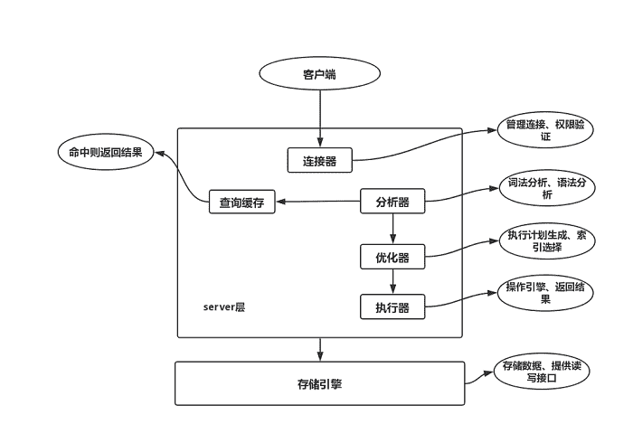

# mysql

本文主要是对mysql数据库的一些学习记录和小结。之所以选择mysql，主要还是工作中遇到的比较多，自己撸点小项目mysql也是首选。

- [mysql](#一-mysql)
    - [mysql架构图](#11-mysql架构图)
        - [一条sql查询语句是怎么执行的](#112-一条sql查询语句是怎么执行的)
    - [常用的存储引擎](#12-常用的存储引擎)
    - [七种join](#13-七种join)
    - [索引](#14-索引)
        - [索引分类](#141-索引分类)
        - [索引的数据结构是什么](#142-索引的数据结构是什么)
        - [建索引](#143-建索引)
    - [性能分析和优化](#15-性能分析)
        - [explain关键字](#151-explain关键字)
        - [数据类型优化](#152-数据类型优化)
            - [常用的几种类型](#1521-常用的几种类型)   
        - [创建高性能索引](153-创建高性能索引) 
        - [查询性能优化](154-查询性能优化) 
    
    
## 1.1 mysql架构图



### 1.1.2 一条sql查询语句是怎么执行的

一个简单的单表查询`select * from user where id = 1`，这条sql是怎么执行的呢？大体上来说mysql可以分为server层和存储引擎层两个部分，server层包括连接器、查询缓存、分析器、优化器、执行器等，以及所有的内置函数比如日期操作、数学等等；而存储引擎层负责数据的存储和查询，其架构模式是插件式，支持innodb、myisam、memory等多个存储引擎。mysql5.5版本后默认引擎就是innodb，也就是说在创建表的时候，如果你没有选择存储引擎，默认就是innodb，不同的存储引擎有着各自不同的业务场景，后面在看。继续分析上面这条简单的sql；
1. 首先是连接器，帮你连接到这个数据库。连接器负责跟客户端建立连接、获取权限、维持和管理连接。连接成功后如果没有后续操作，那么这么连接就处于空闲状态，可以用`show processlist`查看。

| id | User | Host| db | Command | Time | State | Info |
| :------| :------ | :------ |:------ |:------ | :------ | :------ | :------ |
| 1 | root | localhost:35806 | test | Sleep | 16 |  | NULL |

`Command`列显示为`Sleep`表示现在有一个空闲连接。客户端如果很长时间没动静，连接器就会自动断开连接，这个时间是通过`wait_timeout`控制的，默认是8小时。如果在连接被断开后，客户端发送请求的话需要重新建立连接。数据库里面长连接是指连接成功后，如果客户端持续有请求，则一直使用同一个连接，短连接是指每次执行都会建立一个新的连接。建立连接的过程一般是比较复杂的，所以建议使用中尽量减少连接的操作。但是如果都是长连接的话，有时候mysql内存占用特别多，因为mysql在执行过程中使用的内存是在连接对象里面的，这些资源会在断开连接的时候才释放，那么建立连接操作很复杂，要尽可能使用长连接，但是长连接累计下来又很吃内存，怎么解决这个问题？一般有两种方法：

* 定期断开长连接。使用一段时间后，或者程序里判断执行过一个占用大内存的查询后，断开连接，之后查询需要在重连；
* 如果数据库版本是5.7或者更高，可以每次执行一个比较大的操作后，执行`mysql_reset_connection`来重新初始化连接资源。这个过程不需要重连和重新权限认证，但是会将连接恢复到刚刚创建完时的状态；

2. 查询缓存。连接建立完之后就需要执行select语句了，执行逻辑就会来到第二步：查询缓存。mysql在拿到一个查询请求后，会先到查询缓存看看，之前是不是执行过这条语句，之前执行过的查询语句和结果可能会以key-value的形式缓存在内存中。key是查询语句，value是查询的结果。如果查询语句能在缓存中找到，那么结果集就会直接返回给客户端；如果缓存没找到，就会继续后面的执行阶段。缓存sql结果集有利有弊，简单来说跟redis一样，经常变更的表数据，那就最好不要开启缓存，如果是一张静态表或者很长时间才会更新的表，那这张表上的查询可以开启查询缓存。mysql8.0版本直接把查询缓存给删除了，也就是说mysql8.0后就没有这个功能了。
3. 分析器。如果查询缓存没有命中的话，就需要执行sql语句了，首先分析器会做"词法分析"，你输入的是由多个字符串和空格组成的sql语句，mysql需要识别里面的字符串是什么。mysql把你输入的`select` 这个关键字识别出来，说明是一个查询语句，把字符串`user` 识别出来是一张表的名字，把`id` 识别为是一个名字叫`id`的列。做完这些之后就要做"语法分析"。语法分析器会根据规则判断你输入的sql语句是否满足mysql语法，比如`select`你写成了`selec` mysql就会提醒你`You have an error in your SQL syntax; `
4. 优化器。经过前面的步骤，mysql知道要做什么了，在正式执行之前需要经过优化器的处理。优化器是在表里面有多个索引的时候，决定使用哪个索引；或者在一个语句中有多表关联的时候，决定各个表的连接顺序。当然，优化器所选择的，并不一定就是最好、最合适的。后面会有详细的例子来分析这个优化器；
5. 执行器。经过前面的步骤哦，mysql知道要做什么了，优化器也帮我们优化过sql语句了，开始执行的时候，会判断一下你对这个表是否有查询的权限，如果没有就会返回没有权限的错误：`ERROR 1142(42000): SELECT command denied to user 'b'@'localhost' for table 'user' `,如果有权限就继续往下执行，执行的时候执行器会根据表的存储引擎去使用对应的接口。比如我们上面的sql表是`user`列是`id`，如果这个列没有索引，那么执行流程是这样的：

* 调用innodb引擎接口取这个表中第一行，判断id是不是1，如果是则将这行数据存在结果集中，如果不是则继续往下走；
* 调用引擎接口取"下一行"，重复上面的判断逻辑。直到取到这个表的最后一行；
* 执行器将上面遍历过程中所有满足条件的行组成结果集返回给客户端；
至此，这个sql就执行完了。

## 1.2 常用的存储引擎
mysql一般常见的存储引擎是：InnoDB、MyISAM。这两种引擎有什么特别和区别呢？

| 对比项 | MyISAM | InnoDB |
| :------| :------ | :------ |
| 事务 | 不支持 | 支持 |
| 外键 | 不支持 | 支持 |
| 行表锁 | 表锁，即使操作一条记录也会锁住整个表 | 行锁，操作时只锁某一行 |
| 表空间 | 小 | 大 |
| 缓存 | 只缓存索引 | 不光缓存索引，还缓存真实数据，对内存要求较高 |
| 关注点 | 性能 | 事务 |

还有一些区别，后面写例子的时候会记录；怎么选择用哪个引擎呢？我个人觉得主要还是看事务，如果你要支持事务，那就必须InnoDB。注意一点，存储引擎是对表而言的，不是对数据库的操作。

## 1.3 七种join

建了两张表：用户表、部门表，并且插入几条数据。
```sql
CREATE TABLE `sys_dept` (
  `d_id` int(11) NOT NULL AUTO_INCREMENT,
  `dept_name` varchar(30) NOT NULL,
  PRIMARY KEY (`d_id`) USING BTREE
) ENGINE=InnoDB DEFAULT CHARSET=utf8;

CREATE TABLE `sys_user` (
  `id` int(11) NOT NULL AUTO_INCREMENT,
  `name` varchar(30) NOT NULL,
  `dept_id` int(11) DEFAULT NULL,
  PRIMARY KEY (`id`)
) ENGINE=InnoDB DEFAULT CHARSET=utf8;

insert into sys_dept (`dept_name`) VALUES ('技术部');
insert into sys_dept (`dept_name`) VALUES ('行政部');
insert into sys_dept (`dept_name`) VALUES ('销售部');
insert into sys_user (`name`,`dept_id`) VALUES ('张三',1);
insert into sys_user (`name`,`dept_id`) VALUES ('李四',1);
insert into sys_user (`name`,`dept_id`) VALUES ('王五',2);
insert into sys_user (`name`,`dept_id`) VALUES ('赵六',88);
```
为了演示效果上面插入了一条`insert into sys_user (`name`,`dept_id`) VALUES ('赵六',88)`部门ID为88的 其实是没有这个部门的。先看第一种join
* inner join(内连接)

```sql
select * from sys_user su inner join sys_dept sd on su.dept_id=sd.id
```
结果：

| id | name | dept_id| d_id | dept_name |
| :------| :------ | :------ |:------ |:------ |
| 1 | 张三 | 1 | 1 | 技术部 |
| 2 | 李四 | 1 | 1 | 技术部 |
| 3 | 王五 | 2 | 2 | 行政部 |

可以看到`inner join`取的是两个表中都存在的数据,和`join`是相同的效果。

* left join 或者 left outer join(左外连接)

查询所有user以及他们所在的部门-如果有的话
```sql
select * from sys_user su left join sys_dept sd on su.dept_id=sd.d_id 
```
结果：

| id | name | dept_id| d_id | dept_name |
| :------| :------ | :------ |:------ |:------ |
| 1 | 张三 | 1 | 1 | 技术部 |
| 2 | 李四 | 1 | 1 | 技术部 |
| 3 | 王五 | 2 | 2 | 行政部 |
| 4 | 赵六 | 88 |  |  |

发现把用户 赵六也查询出来了，但是他所对应的部门为空，没有ID为88的部门，查询为null。左外连接取左表所有的行，如果左表在右表中没有匹配行也会查询出来，结果都是空值。

* right join 或者 right outer join(右外连接)

```sql
select * from sys_user su right join sys_dept sd on su.dept_id=sd.d_id
```
结果：

| id | name | dept_id| d_id | dept_name |
| :------| :------ | :------ |:------ |:------ |
| 1 | 张三 | 1 | 1 | 技术部 |
| 2 | 李四 | 1 | 1 | 技术部 |
| 3 | 王五 | 2 | 2 | 行政部 |
|  |  |  | 3 | 销售部 |

结果和`left join`相反，取的是右表的所有行。如果右表的某行在左表中没有匹配行，则将为左表返回空值。

* full join(全连接)

mysql没有full join，但是可以用其他方式实现，full join返回的是两个表所有的行，当某行在另一个表中没有匹配行时，则另一个表的选择列表列包含空值。那不就是把left join和right join联合起来使用吗？
```sql
select * from sys_user su left join sys_dept sd on su.dept_id=sd.d_id 
UNION
select * from sys_user su right join sys_dept sd on su.dept_id=sd.d_id 
```
结果：

| id | name | dept_id| d_id | dept_name |
| :------| :------ | :------ |:------ |:------ |
| 1 | 张三 | 1 | 1 | 技术部 |
| 2 | 李四 | 1 | 1 | 技术部 |
| 3 | 王五 | 2 | 2 | 行政部 |
| 4 | 赵六 | 88 |  |  |
|  |  |  | 3 | 销售部 |

结果就是两个表的所有行，当某行在另一个表中没有匹配行时，则另一个表的选择列表列包含空值。

* 左连接(左独有连接)

首先看一下上面的左外连接的结果集，是左表所有行加上右表匹配行，如果有不嘛匹配的就显示空值。而左连接(左独有连接)就是左表的行在右表中没有匹配的。
```sql
select * from sys_user su left join sys_dept sd on su.dept_id=sd.d_id where sd.d_id is null
```

| id | name | dept_id| d_id | dept_name |
| :------| :------ | :------ |:------ |:------ |
| 4 | 赵六 | 88 |  |  |

查询出来只有一个赵六，因为只有他的部门ID在部门表中没有。

* 右连接(右独有连接)

```sql
select * from sys_user su right join sys_dept sd on su.dept_id=sd.d_id  where su.dept_id is NULL
```
结果：

| id | name | dept_id| d_id | dept_name |
| :------| :------ | :------ |:------ |:------ |
|  |  |  | 3 | 销售部 |

和上面的相反。结果就是 右表中的销售部 在左表中没有匹配项的被查出来。

* 全连接去交集(取两张表中都没有匹配的数据集)

```sql
select * from sys_user su left join sys_dept sd on su.dept_id=sd.d_id where sd.d_id is null
UNION
select * from sys_user su right join sys_dept sd on su.dept_id=sd.d_id  where su.dept_id is NULL
```
结果:

| id | name | dept_id| d_id | dept_name |
| :------| :------ | :------ |:------ |:------ |
| 4 | 赵六 | 88 |  |  |
|  |  |  | 3 | 销售部 |

## 1.4 索引

索引是一种帮助mysql高效的获取数据的数据结构。可以简单的理解成排序好的快速查找数据结构。
* 索引的优点：1.天生排序。2.快速查找
* 索引的缺点：1.占用空间。2.降低更新表速度

### 1.4.1 索引分类

* 普通索引: 最基本的索引，没有什么约束；
* 唯一索引：和普通索引类型，但是有唯一性约束；
* 主键索引：特殊的索引，不允许有空值；
* 复合索引：将多个列组成的一个索引；
* 外键索引：只有InnoDB引擎的表才可以使用外键索引，保证数据的一致性、完整性；
* 全文索引：mysql自带的全文索引只能用于InnoDB、MyISAM，并且只能对英文进行全文检索，一般使用全文索引引擎(ES，Solr)；
注意：主键就是唯一索引，但是唯一索引不一定是主键，唯一索引可以为空，但是空值只能有一个，主键不能为空。

### 1.4.2 索引的数据结构是什么

mysql的索引使用了B+Tree结构。为什么不使用其他的数据结构呢？
* 使用二叉树的缺陷

在一些情况下会出现结构偏移，极端情况下会形成一条链表的形式。


* 使用平衡二叉树缺陷

上面说的二叉树的缺陷，是可能形成链表，那么使用平衡二叉树不就行了吗？先看下平衡二叉树的定义：在二叉树的基础上，保证每个节点左子树和右子树的高度差小于等于1。那么mysql为什么不用平衡二叉树这样的数据结构呢？

1. 维护这种高度平衡所付出的代价比从中获取的收益要大，简单地说就是弊大于利，在每次插入、删除元素的时候会通过一次或者多次的左旋或者右旋来保证树的平衡。所以实际应用不多，更多的是追求局部平衡的红黑树结构；
2. 查询效率不高，一般来说数的高度和IO次数是成正比的，当数据量很大的时候，树的高度就会很恐怖，导致查询性能降低；
3. 节点存储的数据内容太少。没有很好利用操作系统和磁盘数据交换特性，也没有利用好磁盘IO的预读能力。因为操作系统和磁盘之间一次数据交换是已页为单位的，一页 = 4K，即每次IO操作系统会将4K数据加载进内存。但是，在二叉树每个节点的结构只保存一个关键字，一个数据区，两个子节点的引用，并不能够填满4K的内容。幸幸苦苦做了一次的IO操作，却只加载了一个关键字，在树的高度很高，恰好又搜索的关键字位于叶子节点或者支节点的时候，取一个关键字要做很多次的IO。


* 使用红黑树的缺陷

红黑树和平衡二叉树很类似，都是在进行插入或者删除操作的时候通过特定操作保证树的平衡，从而获得比较高的查询性能，但是红黑树在最坏的情况下运行也是比较良好的。但是红黑树是二叉树，也就是一个节点下有两个分支，而B树可以有多个叶子节点，所以在大规模数据存储的时候红黑树的高度会更高一点，从而造成磁盘IO读写次数过多，导致索引效率低下。

定义：
1. 节点是红色或者黑色；
2. 根节点是黑色；
3. 每个红色节点的两个子节点都是黑色。(从每个叶子到根的所有路径上不能有两个连续的红色节点)；
4. 从任一节点到其每个叶子的所有路径都包含相同数目的黑色节点。

第三条定义规则约束了红黑树从根到叶子的最长的可能路径不多于最短的可能路径的两倍长。结果是这个树大致上是平衡的。因为操作比如插入、删除和查找某个值的最坏情况时间都要求与树的高度成比例，这个在高度上的理论上限允许红黑树在最坏情况下都是高效的。根据定义4所有最长的路径都有相同数目的黑色节点，这就表明了没有路径能多于任何其他路径的两倍长。
虽然红黑树相对于二叉树而言不会有太严重的单边偏移(形成链表)，也不会像平衡二叉树一样需要保证高度的平衡，但是避免不了极端情况下树的重心出现偏移的情况。而且mysql是基于磁盘的数据库，索引是以索引文件的形式存在于磁盘中，索引的查找过程就会涉及到磁盘IO消耗，磁盘IO的消耗相比较于内存IO的消耗要高好几个数量级，所以索引的组织结构要设计得在查找关键字时要尽量减少磁盘IO的次数。实际过程中，磁盘并不是每次严格按需读取，而是每次都会预读。磁盘读取完需要的数据后，会按顺序再多读一部分数据到内存中，这样做的理论依据是计算机科学中注明的局部性原理：`当一个数据被用到时，其附近的数据也通常会马上被使用`，

* B-Tree('-'不是读 减，多路平衡树)

BTree是一种多路自平衡搜索树，和二叉树类型，但是BTree允许每个节点有更多的叶子节点。BTree有个特点: 不管是叶子节点还是非叶子节点都有个Data域，用来保存实际的数据。索引本身也很大，不可能全部存储在内存中，因此索引往往以索引文件的形式存储的磁盘上。这样的话，索引查找过程中就要产生磁盘I/O消耗，相对于内存存取，I/O存取的消耗要高几个数量级，所以索引的结构组织要尽量减少查找过程中磁盘I/O的存取次数，提升索引效率。为了达到这个目的，磁盘往往不是严格按需读取，而是每次都会预读，即使只需要一个字节，磁盘也会从这个位置开始，顺序向后读取一定长度的数据放入内存。预读可以提高I/O效率。预读的长度一般为页page:页是计算机管理存储器的逻辑块，硬件及操作系统往往将主存和磁盘存储区分割为连续的大小相等的块）的整倍数。数据库系统的设计者巧妙的利用了磁盘预读原理，将一个结点的大小设为等于一个页面，这样每个结点只需要一次I/O就可以完全载入。为了达到这个目的，在实际实现B-Tree还需要使用如下技巧：每次新建结点时，直接申请一个页面的空间，这样可以保证一个结点的大小等于一个页面，加之计算机存储分配都是按页对齐的，就实现了一个node只需一次I/O。

缺点：
1. B-Tree每个节点都有一个data域用来存放实际的数据，导致每次IO查询出来的数据有索引也有数据，如果这里面并没有的所需要的数据，那还不如读出来的都是索引，根据索引在去查具体的数据；
2. B-Tree因为其分支结点同样存储着数据，我们要找到具体的数据，需要进行一次中序遍历按序来扫描，而B+Tree所有数据都存在于叶子节点，并且使用链表相连接，所以B+Tree更加适合在区间查询的情况，所以通常B+树用于数据库索引。
3. B-Tree在提高了IO性能的同时并没有解决元素遍历的我效率低下的问题，正是为了解决这个问题，B+Tree应用而生。B+Tree只需要去遍历叶子节点就可以实现整棵树的遍历。而且在数据库中基于范围的查询是非常频繁的，而B-Tree不支持这样的操作或者说效率太低。

* B+Tree

B+Tree是应文件系统所需而产生的一种BTree的变形树（文件的目录一级一级索引，只有最底层的叶子节点（文件）保存数据）非叶子节点只保存索引，不保存实际的数据，数据都保存在叶子节点中，这不就是文件系统文件的查找吗?

B+Tree和B-Tree非常相似，区别在于：
1. B+Tree的磁盘读写代价更低：B+Tree只有最下层叶子节点才会保存数据，所以每次加载到内存里的index信息就会变多(BTree每个节点都有index信息和真实数据，如果把这些加载到内存里，最后发现并没有我所需要的数据，岂不是完全浪费了？)，所以B+Tree每次IO的时候读取的都是index信息，先找到索引位置，然后在根据索引去拿真是数据，这样可以减少IO次数；
2. B+Tree的所有根节点都不存储实际数据，只有索引信息，所有的数据都存在叶子节点里；
3. B+Tree所有的叶子结点和相邻的节点使用链表相连，便于区间查找和遍历；
4. B+Tree索引在数据库中还有一个特点是高扇出性，因此B+Tree在数据库中树的高度一般都在2~4层，这也就是说查找某一个键值的行记录最多只需要2~4次IO。

简单小结一下：

* mysql使用B+Tree肯定是为了提高查询效率，那具体怎么提高呢？一般数据量小的情况下，直接链表式查询即可，但是当数据量很大的时候，可以用二叉树，二分法查找复杂度为O(log2n)，可以说效率提升很多，但是树结构的效率很大程度上由树的高度决定，所以要尽可能把树设计的“矮、胖”，在众多的解决方案中，B-/B+树很好的适合。B-树定义具体可以查阅，简而言之就是中间节点可以多余两个子节点，而且中间的元素可以是一个域。相比B-树，B+树的父节点也必须存在于子节点中，是其中最大或者最小元素，B+树的节点只存储索引key值，具体信息的地址存在于叶子节点的地址中。这就使以页为单位的索引中可以存放更多的节点。减少更多的I/O支出。因此，B+树成为了数据库比较优秀的数据结构，MySQL中MyIsAM和InnoDB都是采用的B+树结构。
* 还有一个常被忽视的问题：B+Tree索引并不能找到一个给定值的具体行,B+Tree索引能找到的只是被查找数据行所在的页，然后数据库通过把页读入到内存，再在内存中进行查找，最后得到要查找的数据;


### 1.4.3 建索引

哪些情况下可以考虑建索引：
* 主键自动建立的唯一索引；
* 频繁作为查询条件的字段应该建索引；
* 查询中与其他表关联的字段，外键关系应该建索引；

哪些情况下不建议建索引：
* 表的增删改太多；
* 表记录太少；
* 对于性别、地区、类型等字段，他们的取值范围很小，就没有必要建索引，引入一个索引的选择性的概念：
索引列中不同值的数量与表中所有记录数量的比。例：一个表有2000条数据，索引的列有1990个不同值，那么这个索引的选择性就是1990/2000=0.99；一个索引的选择性越接近于1，这个索引的效率就越高；这个索引选择性mysql也提供了查询方式：`show index from tableName` 其中的Cardinality就是这个索引选择性的预估值，越接近于1越好；

### 1.5 性能分析

性能分析的方法有很多，作为JAVA程序员，最常用的应该是explain了吧。

### 1.5.1 explain关键字

关键字：explain可以模拟数据库优化器执行sql查询语句，从而知道mysql是怎么执行你的sql语句的。实际使用：`explain select * from t_user`,看一下查询出来各个列都是什么意思？
* id：值为一个整数，表示表的读取顺序，有三种情况：
1. 如果值相等，说明是按照从上至下的顺序执行的；
2. 值都不相等，值越大越先被执行；
3. 有些值相同，有些不相同，同样的 值大的先执行，值相等的按照从上至下的顺序执行；

* select_type: 数据读取的操作类型
1. SIMPLE： 简单的select查询，查询中不包括子查询或者union；
2. PRIMARY: 查询中若包含任何复杂的子部分，最外层的查询则会被标记为PRIMARY；
3. SUBQUERY: select或者where中包含了子查询；
4. DERIVED: 在from列表中包含的子查询被标记为DERIVED(衍生表),mysql会递归执行这些子查询，把结果放到临时表里；
5. UNION RESULT: 若第二个select在UNION之后则会被标记为 UNION

* table：显示这一行的数据是哪张表的

* type: 访问类型排列

性能有低到高排列如下：

1. ALL：表示全表扫描(如果单表百万级数据出现ALL就要优化了)
2. index: index与ALL区别为index类型只遍历索引树;
3. range: 只检索给定范围的行，使用一个索引来选择行
4. ref: 非唯一性索引扫描，返回匹配某个单独值的所有行，本质上也是一种索引访问，它返回所有匹配某个单独值的行，可能会找多个符合条件的行，属于查找和扫描的混合体;
5. eq_ref: 唯一性索引扫描，对于每个索引键，表中只有一条记录与之匹配。常见于唯一索引或者主键扫描;
6. const：表示通过索引一次就找到，const用于比较primary key或者unique索引。因为只匹配一行数据，所以如果将主键置于where列表中，mysql能将该查询转换为一个常量;
7. system: 表中仅有一行（=系统表）这是const联结类型的一个特例。
一般要保证至少达到range级别，当然越高越好了。

* possible_keys：指出MySQL能使用哪个索引在该表中找到行(不是实际使用到的)
* keys：当前sql查询在执行时实际用到的索引；
* key_len： 表示索引中使用的字节数，该列计算查询中使用的索引的长度在不损失精度的情况下，长度越短越好。如果键是NULL,则长度为NULL。该字段显示为索引字段的最大可能长度，并非实际使用长度；
* ref: 显示索引的哪一列被使用了，如果有可能是一个常数，哪些列或常量被用于查询索引列上的值;
* rows: 根据表统计信息以及索引选用情况，大致估算出找到所需的记录所需要读取的行数;

* Extra: 包含不适合在其他列中显示，但是十分重要的额外信息

1. <font color=red>Using filesort：</font>"文件内排序"，mysql无法用索引完成排序;
2. Using temporary:使用了临时表保存中间结果，mysql在查询结果排序时使用临时表。常见于排序order by和分组查询group by;
3. Using index:表示相应的select操作用使用覆盖索引，避免访问了表的数据行。如果同时出现using where，表名索引被用来执行索引键值的查找；如果没有同时出现using where，表名索引用来读取数据而非执行查询动作;
4. Using where: 表明使用where过滤;
5. using join buffer: 使用了连接缓存;
6. impossible where: where子句的值总是false，不能用来获取任何元组;
7. select tables optimized away：在没有group by子句的情况下，基于索引优化Min、max操作或者对于MyISAM存储引擎优化count（*），不必等到执行阶段再进行计算，查询执行计划生成的阶段即完成优化;
8. distinct：优化distinct操作，在找到第一匹配的元组后即停止找同样值的动作。

在使用`exlpain`的时候，比较重要的几个列是：<font color=red>type、possible_keys、keys、rows、Extra</font>


### 1.5.2 数据类型优化

Mysql支持的数据类型非常多，选择一个合适的数据类型对于获得高性能至关重要；不管存储那种数据类型的数据，有几个原则都有助于做出更好的选择；

* 更小的通常更好

一般情况下，应该尽量使用可以正确存储数据的最小数据类型(例如只需要存0~200，tinyint unsigned更好),更小的数据类型通常更快，因为它们占用更少的磁盘、内存、cpu缓存，并且处理时需要的cpu周期也更少。但是要确保没有低估需要存储的值的范围，如果无法确定选哪个数据类型是最好的，就选择你认为绝对不会超过范围的最小类型；

* 简单就好

简单的数据类型的操作通常需要更少的cpu周期。例如：整型比字符操作代价更低。在比如，最好是使用Mysql内建类型(date,time,datetime)，而不是用字符串来存储日期和时间；

* 尽量避免使用NULL

1. 很多表都包含可以为NULL的字段，通常情况下最好指定列为not null，除非真的需要存储NULL值。如果查询中包含可以为NULL的值，对mysql来说优化更难，因为可以为null的列使得索引查询更加复杂。
2. 可为null的列可能会消耗更多的存储空间。
3. 一般把可为null的列改成not null，性能提升是比较小的，但是如果这个列是准备做索引列，就应该尽量避免为null；

### 1.5.2.1 常用的几种类型

* 整数类型

如果存储整数可以使用这几种类型：tinyint、smallint、mediumint、int、bigint。分别使用8,16,24,32,64位存储空间。它们可以存储的值的范围是从-2<sup>n-1</sup> 到 2<sup>n-1</sup>-1，其中n是存储空间的位数；
整数类型有可选的unsigned属性，表示无符号类型 不允许负值，可以使正数的上限值提高一倍，例如tinyint的存储值范围是-128到127，而用unsigned后范围是 0到255；
有符号和无符号类型性能一样，这个主要根据实际业务情况选择了。mysql可以为整数类型指定宽度，例如int(10)，这里要注意的是：这样写不会限制值的合法范围，只是规定了显示字符的个数，对于存储和计算来说int(1)和int(10)是相同的；

* 浮点类型

float、double、decimal三种常用的存储小数数值的类型。double相比float有更高的精度和更大的范围，如果需要经常对小数进行精确计算那么建议使用decimal类型，例如存储财务数据,<font color=red>但是如果数据量很大，可以考虑使用bigint代替decimal，将需要存储的货币单位根据小数的位数乘以相应的倍数即可。例如财务需要精确到万分之一分，则可以把金额乘以100万，然后将结果存在bigint里面，这样可以避免计算精度不准确和decimal精确计算代价高的问题</font>；

* 字符串类型

1. char：存储定长字符，mysql根据定义的字符串长度分配对应的空间
   * 优点：char因为是定长的，即使值变化，但是长度不会变，不容易产生碎片(分裂页)；
   * 缺点：长度是固定的；
2. varchar:存储可变长度字符串。varchar需要额外的1或者2个字节来记录字符串的长度。
   * 优点：比定长的类型更节省空间，因为它仅使用必要的空间(越短的字符串使用越少的空间)；
   * 缺点：由于是变长的，update的时候可能变得比以前更长，如果一个行占用空间增加，并且页(上面B+ree的时候大概说过)内没有更多的空间可以存储，Innodb则需要分裂页，造成性能降低；
   
有几个注意点：
* varchar越短的字符串使用越少的空间，那么定义的时候就能把他定义的大一点吗？比如varchar(10)就够用了，但是却定义成varchar(200)。对于VARCHAR数据类型来说，硬盘上的存储空间虽然都是根据实际字符长度来分配存储空间的，但是对于内存来说，则不是。其时使用固定大小的内存块来保存值。简单的说，就是使用字符类型中定义的长度，即200个字符空间。显然，这对于排序或者临时表(这些内容都需要通过内存来实现)作业会产生比较大的不利影响。
* 从碎片角度进行考虑，使用char字符型时，由于存储空间都是一次性分配的。为此某个字段的内容，其都是存储在一起的。单从这个角度来讲，其不存在碎片的困扰。而可变长度的字符数据类型，其存储的长度是可变的。当其更改前后数据长度不一致时，就不可避免的会出现碎片的问题。
* 考虑其长度的是否相近，如果某个字段其长度虽然比较长，但是其长度总是近似的，甚至是相同的长度。此时比较适合采用char字符类型。比较典型的应用就是MD5加密。当利用MD5哈希值来存储用户密码时，就可以采用CHAR字符类型。因为其长度是相同的。另外，像用来存储用户的身份证号码等等，一般也建议使用char。

小结：二者在磁盘上存储占的空间是一样的。区别有二。第一、一个变长一个固定长度。第二、在内存中的操作方式，varchar也是按照最长的方式在内存中进行操作的。比如说要进行排序的时候，varcahr(100)是按照100这个长度来进行的；

* 日期和时间类型

时间类型我们常用的应该就是datetime和timestamp。主要还是看一下这两种常用的有什么区别吧。

1. datetime：能保存大范围的值，从1001年到9999年，精度到秒，占用8个字节空间，与时区无关，存的是什么取出来就是什么；
2. timestamp：保持了从1970年1月1日午夜以来的毫秒数，占用4个字节空间，客户端插入的时间从当前时区转化为UTC（世界标准时间）进行存储。查询时，将其又转化为客户端当前时区进行返回。

一般来讲这两种没什么太大的区别，非要强行对比性能的话，timestamp占用4个字节而datetime占用8个字节，效率稍微高一点。如果需要存储比秒更小粒度的日期和时间怎么办？可以使用bigint类型存储微妙级别的时间戳。

* 选择identifier标识符

mysql建议使用自增策略 做表的主键，这样可以避免页的分裂(其实就是要了解mysql底层数据结构，上面B+tree的时候也提到),mysql底层数据结构是 B+tree，所谓的索引其实就是一颗 B+tree，一个表有多少个索引就会有多少颗 B+tree，mysql 中的数据都是按顺序保存在 B+tree上的,然后 mysql 在底层又是以数据页为单位来存储数据的，一个数据页大小默认为 16k(有些地方说8K，这个看具体情况，操作系统啥的)，当然你也可以自定义大小，也就是说如果一个数据页存满了，mysql 就会去申请一个新的数据页来存储数据，如果主键为自增 id 的话，mysql 在写满一个数据页的时候，直接申请另一个新数据页接着写就可以了，如果主键是非自增 id，为了确保索引有序，mysql 就需要将每次插入的数据都放到合适的位置上。如果使用非自增主键（如果身份证号或学号等），由于每次插入主键的值近似于随机，因此每次新纪录都要被插到现有索引页得中间某个位置，此时MySQL不得不为了将新记录插到合适位置而移动数据，甚至目标页面可能已经被回写到磁盘上而从缓存中清掉，此时又要从磁盘上读回来，这增加了很多开销，同时频繁的移动、分页操作造成了大量的碎片。

### 1.5.3 创建高性能索引

1. 独立的列
索引列不能是表达式的一部分或者函数的参数，比如对索引列进行加减等运算`select price from table_name where price + 1 =10000`,比如对索引列使用函数：`select ... where TO_DAYS(create_time) = 10000`；

2. 选择合适的索引顺序
建符合索引的时候(把多个列组成一个索引)多列索引的顺序非常重要，怎么安排列的顺序有个经验：将选择性最高的列放到最前面(当然肯定还是要看具体的业务情况，没有绝对的东西)，如果不需要考虑排序和分组时，将选择性最高的放到最前列是比较合适的，还要根据那些查询使用最多的列来调整顺序，比如`select * from order where staff_id = 123 and customer_id = 5`,是应该建立一个(staff_id,customer_id)索引还是颠倒一下顺序呢？可以用下面的sql测试一下两个条件对应的数据基数有多少。
`select sum(staff_id=123),sum(customer_id=5) from order`，假设查询的结果是8000，50。那么应该将customer_id放在前面，因为这个sql可以分析出customer_id=5的数据只有50条，说明大部分的customer_id的值是不相同的，选择性比较高(选择性计算方法上面已经讲过了)，因此可以考虑(customer_id,staff_id)，也要考虑实际业务情况，比如说业务情况下，用户很大概率会提交staff_id这个查询条件，小概率使用customer_id，那么情况就又不一样了，可能(customer_id,staff_id)反而是个合适的选择。(具体情况具体对待)


### 1.5.4 查询性能优化
